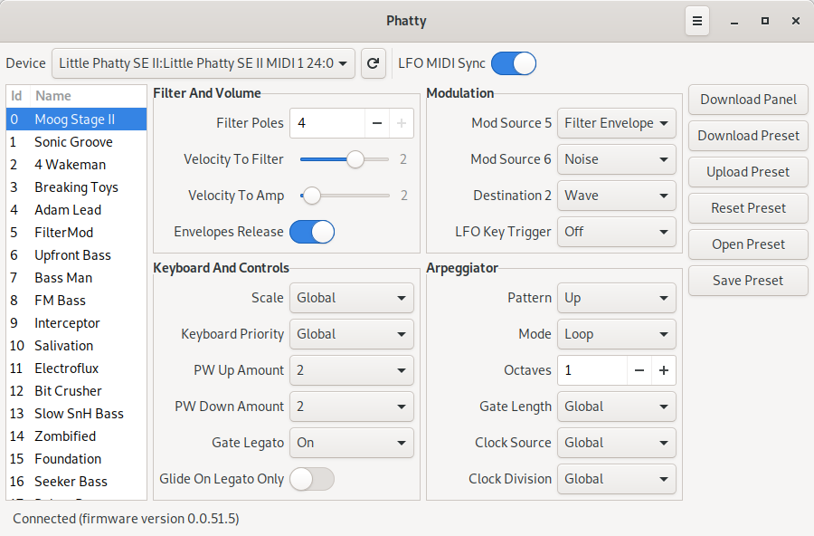

# Phatty

Phatty is a library editor for the Moog Little Phatty. It has been designed to work together with the synth by providing an easy edition of the hidden parameters. Besides, you will be able to rename and rearrange presets.

## Installation
Phatty is a Python package that is installed the standard way with `python3 setup.py install`. However, as it contains desktop application related resources, it is installed with `make`.

The package dependencies for Debian based distributions are:
- make
- python3
- python3-setuptools
- python3-mido
- python3-rtmidi

You can easily install them by running `sudo apt-get install make python3 python3-setuptools python3-mido python3-rtmidi`.

To install Phatty symply run `make && sudo make install`.

## Known issues
At the moment, the underlying MIDI libraries do not raise an error if the synth is disconnected. Thus, neither the application can be aware of the error nor the user get any error message.
